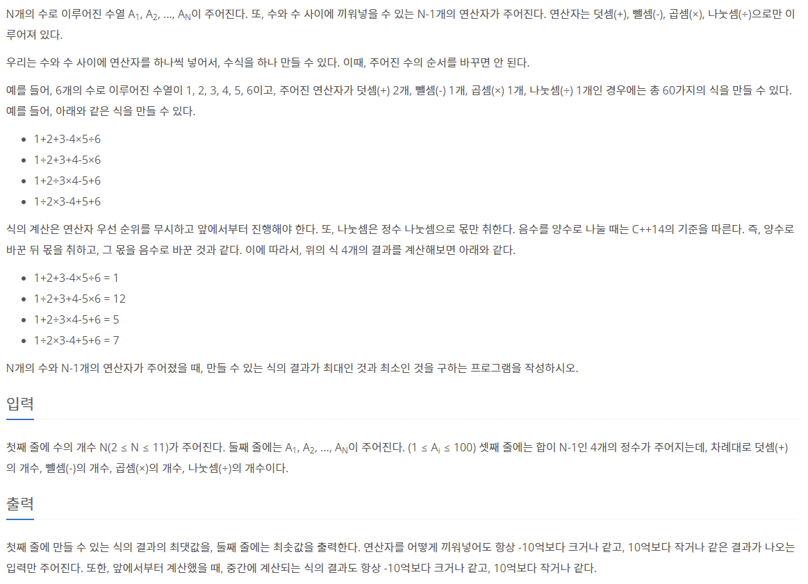

### 📔 문제 설명



### 🧰 변수 설명

- **N**
  - 타입 : 정수
  - 저장 데이터 : 입력 받을 숫자의 수를 저장합니다.

- **operations**
  - 타입 : 리스트
  - 저장 데이터 : 사용 가능한 연산자를 모아놓은 리스트

- **number_input**
  - 타입 : 리스트
  - 저장 데이터 : 입력받은 숫자를 리스트로 저장

- **operation_input**
  - 타입 : 리스트
  - 저장 데이터 : 입력받은 연산자 개수를 리스트로 저장

- **operation_list**
  - 타입 : 리스트
  - 저장 데이터 : 입력받은 연산자 개수 만큼 사용가능한 중복되지 않은 조합을 저장

- **result**
  - 타입 : 정수
  - 저장 데이터 : 계산한 값 저장
  
- **answer**
  - 타입 : 리스트
  - 저장 데이터 : 계산한 값 들을 저장
### 🖨풀이 과정

```txt
1. 입력받을 변수들을 입력 받는다. [ N, number_input, operation_input ]
2. 사용 가능한 연산자들을 저장한다. [ operations ]
3. for문을 통해 operation_input 에 입력된 값 만큼 operations에서 꺼내서 저장한다.
4. permutations를 통해 operations에 저장된 값 들로 사용가능한 모든 조합을 저장한다.
5. 이때 중복된 조합이 있으면 시간이 초과되므로 set을 통해 중복을 제거해준다.
6. 이중 for문을 통해 연산자를 뺀 후 그 연산자에 값들을 계산한다.
7. answer에 저장된 값들을 max와 min을 통해 최대, 최소 값을 출력해준다.

```

```python
from itertools import permutations
import sys
N = int(sys.stdin.readline())
operations = ['+', '-', '*', '/']
number_input = list(map(int, sys.stdin.readline().split()))
operations_input = list(map(int, sys.stdin.readline().split()))  # + - * / 순서대로 숫자를 입력

operation_list = []

for i in range(4):
    for j in range(operations_input[i]):
        operation_list.append(operations[i])
print(operation_list)
operation_list = list(set(permutations(operation_list)))
# 가능한 조합을 모두 사용하기 위해 permutations를 사용하여 조합들을 list에 저장
# 이때 set을 사용하지 않고 중복된 조합들도 사용하게 할 시 시간초과가 뜨므로 set을 통해 중복은 제거해준다.
answer = []

for i in operation_list:
    result = number_input[0]
    for j in range(N - 1):
        if i[j] == '+':
            result += number_input[j + 1]
        elif i[j] == '-':
            result -= number_input[j + 1]
        elif i[j] == '*':
            result *= number_input[j + 1]
        else:
            if result // number_input[j + 1] < 0:
                result = -(-result // number_input[j + 1])
            else:
                result = result // number_input[j + 1]

    answer.append(result)
print(max(answer))
print(min(answer))

```

시간 : **608ms**
