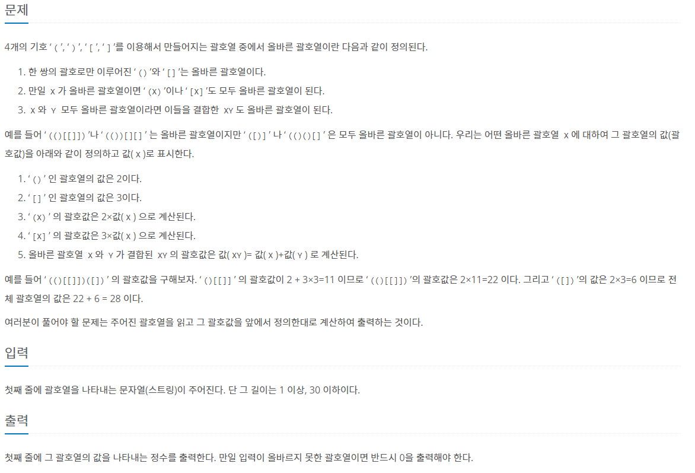

### 📔 문제 설명



### 🧰 변수 설명

- **stack**
  - 타입 : 리스트
  - 저장 데이터 : 입력받은 문자열에서 괄호를 저장하는 리스트
- **answer**
  - 타입 : 정수
  - 저장 데이터 : 계산한 괄호 값
- **bracket**
  - 타입 : 리스트
  - 저장 데이터 : 입력받은 괄호 문자열
- **temp**
  - 타입 : 정수
  - 저장 데이터 : 괄호 값 계산을 위한 변수

### 🖨풀이 과정

```txt
1. 문자열을 입력 받는다. [ bracket ]
2. 괄호가 들어왔을 때 여는 괄호를 저장하기 위한 리스트를 선언한다. [ stack ]
3. 괄호 값들을 계산해 최종 값 [ answer ] 에 넣어주기 위한 변수를 선언한다. [ temp ] 
(이때 곱하기가 있기 때문에 값을 1로 선언 )
4. bracket의 문자열 길이만큼 반복하는 반복문을 작성한다.
5-1. 들어온 값이 여는 괄호 일 경우 stack에 그 괄호를 저장한다.
5-2. 들어온 값이 닫는 괄호 인데 그 전 값이 짝이 맞는 여는 괄호 일 경우 temp 값을 answer에 더해준 후
     stack.pop으로 값을 빼고 temp //= 2 를 통해 temp 값을 전으로 돌려준다
5-3. 들어온 값이 닫는 괄호 인데 그 전 값이 짝이 맞지 않는 괄호이거나, 
     stack이 비어있다면 answer값을 0으로 만들고 반복문을 종료한다.
6. 반복문이 종료 후 stack에 값이 남아있다면 제대로 괄호가 해결되지 않은 것 이므로 0을 출력한다.
7. stack에 값이 없다면 모든 괄호가 정상적으로 나간 것 이므로 answer 값을 출력한다.
```

```python
bracket = list(input())

stack = []
answer = 0
temp = 1

for i in range(len(bracket)):

    if bracket[i] == "(":
        stack.append(bracket[i])
        temp *= 2

    elif bracket[i] == "[":
        stack.append(bracket[i])
        temp *= 3

    elif bracket[i] == ")":
        if not stack or stack[-1] == "[":
            answer = 0
            break
        if bracket[i-1] == "(":
            answer += temp
        stack.pop()
        temp //= 2

    else:
        if not stack or stack[-1] == "(":
            answer = 0
            break
        if bracket[i-1] == "[":
            answer += temp

        stack.pop()
        temp //= 3

if stack:
    print(0)
else:
    print(answer)

```

시간 : **72ms**
