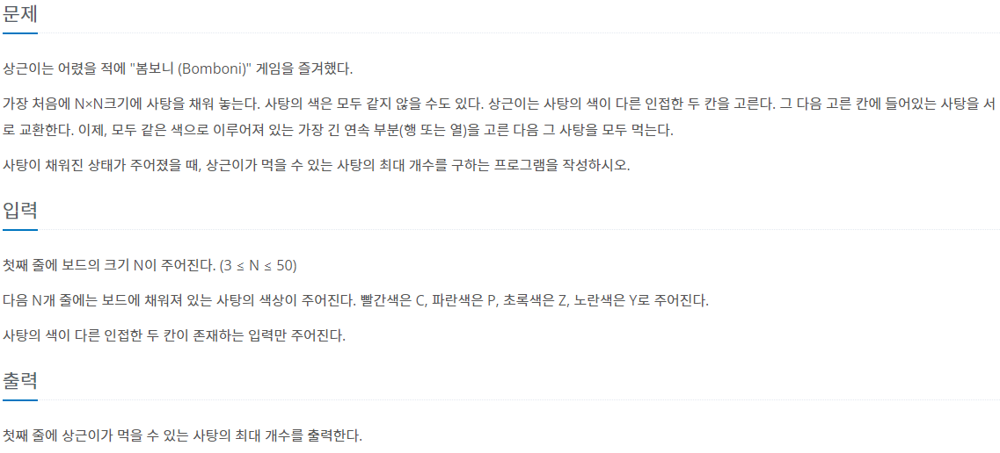

### 📔 문제 설명



### 🧰 변수 설명

- **n**
    - 타입 : 정수
    - 저장 데이터 : 보드의 크기를 입력받는다.
- candies
    - 타입 : 리스트
    - 저장 데이터 : 사탕의 색상
- answer
    - 타입 : 정수
    - 저장 데이터 : 먹을 수 있는 사탕의 최대 개수
- count
    - 타입 : 정수
    - 저장 데이터 : 사탕 개수 카운트

### 🖨풀이 과정

```txt
1. 보드 판의 크기 입력 [ n ]
2. 캔디들의 색을 저장할 리스트 선언 [ candies ]
3. 먹을 수 있는 캔디의 최종 개수를 저장할 변수 선언 [ answer ]
4. n 만큼 반복하며 사탕들의 색상을 입력받는다.
5. 반복문을 통해 몇개의 같은 색상 캔디가 이어지는지 확인하는 함수 선언 [ search ]
6. n만큼 반복하는 for문을 통해 캔디들의 위치를 바꿔가며 search 함수를 호출해 사탕의 최대 개수 찾기
7. 모든 반복이 종료된 후 answer에 저장된 최대 개수 출력
```

```python
n = int(input())
candies = []
answer = 1

for i in range(n):
    temp = []
    temp_str = input()
    for j in range(n):
        temp.append(temp_str[j])
    candies.append(temp)


# 몇개 먹을 수 있는지 찾는 함수
def search():
    global answer
    for i in range(n):
        count = 1
        for j in range(n - 1):
            if candies[i][j] == candies[i][j + 1]:
                count += 1
                answer = max(count, answer)
            else:
                count = 1
    for i in range(n):
        count = 1
        for j in range(n - 1):
            if candies[j][i] == candies[j + 1][i]:
                count += 1
                answer = max(count, answer)
            else:
                count = 1


# [모든 인접한 두 자리 뒤집어보고 찾기]
# 가로 뒤집기
for i in range(n):
    for j in range(n - 1):
        candies[i][j], candies[i][j + 1] = candies[i][j + 1], candies[i][j]
        search()
        candies[i][j], candies[i][j + 1] = candies[i][j + 1], candies[i][j]

# 세로 뒤집기
for i in range(n):
    for j in range(n - 1):
        candies[j][i], candies[j + 1][i] = candies[j + 1][i], candies[j][i]
        search()
        candies[j][i], candies[j + 1][i] = candies[j + 1][i], candies[j][i]

print(answer)
```

시간 : **ms**


