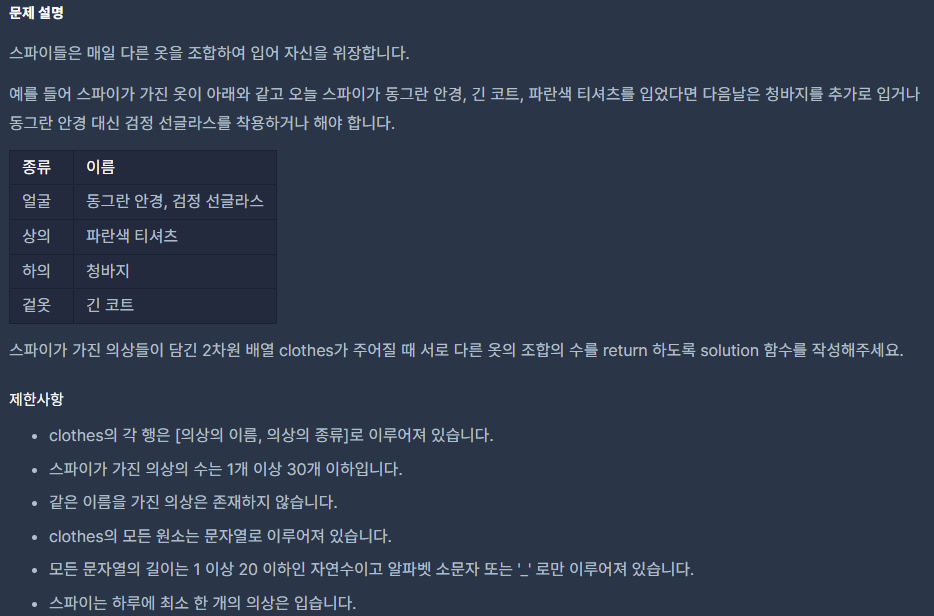

### 📔 문제 설명


### 🧰 변수 설명

- **answer**
    - 타입 :  정수
    - 저장 데이터 : 서로 다른 옷의 조합의 수
- arr
  - 타입 : 리스트
  - 저장 데이터 :  의상의 종류만 저장하는 리스트
- kind
  - 타입 : collections.Counter
  - 저장 데이터 : 의상을 종류별로 카운트하여 개수 저장
- kind_list
  - 타입 : 리스트
  - 저장 데이터 : kind 의 value 인 의상별 카운트를 리스트로 저장
### 🖨풀이 과정

```txt
1. for문을 통해 입력받은 값 중에 종류 부분만 arr 변수에 리스트로 담는다. [arr]
2. collections를 import 하여 Counter를 통해 arr 배열의 종류 별 개수를 카운트 해준다. [kind]
3. kind_list 변수에 kind의 value인 종류별 개수만 따로 뽑아 저장한다.
4. kind_list로 for문을 통해 요소를 하나씩 뽑아 곱의 법칙으로 
   answer = answer * (i + 1) 을 한 값을 저장해준다.
5. 아무것도 입지 않는 경우의 수를 제외해야 하므로 answer에 1을 빼준 값을 return

```
```python
import collections
def solution(clothes):
    answer=1
    arr=[]
    for i,j in clothes:
        arr.append(j)
    
    kind=collections.Counter(arr)
    kind_list=list(kind.values())
    
    for i in kind_list:
        answer*=(i+1)
    
    return answer-1
```
정확성: **100.0**

합계: **100.0 / 100.0**
